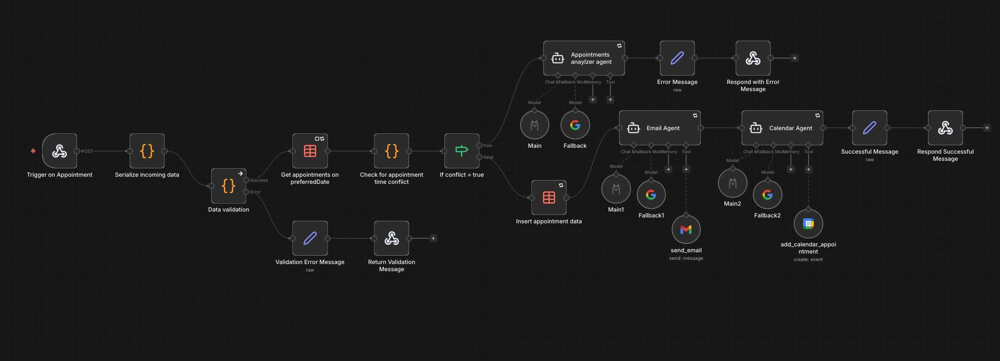
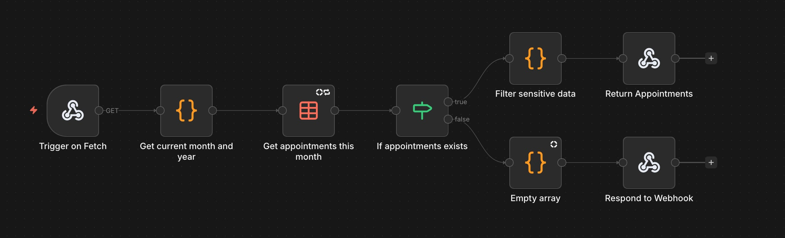

# automated-appointment

This is the repository for the automated appointment
for a fictional Photography Studio Business. This uses n8n for
most of the backend operations.

## Prerequisites

- n8n
- Ollama
- Gemini
- pnpm

## What does it do?

The main purpose of this automated appointment, is to eliminate
manual and repetitive human tasks, such as assigning and scheduling
appointments, setting a calendar reminder date and sending emails to clients.

Not all that, it also eliminates the need of using traditional tools
such as pen and paper to track appointments made by users. By leveraging
local LLMs by Ollama and third party ones like Gemini, with the help
of AI agents, it makes life easier and the business can focus more on
productive things.

## n8n workflows

### Automated Appointments

### Fetching Appointments

